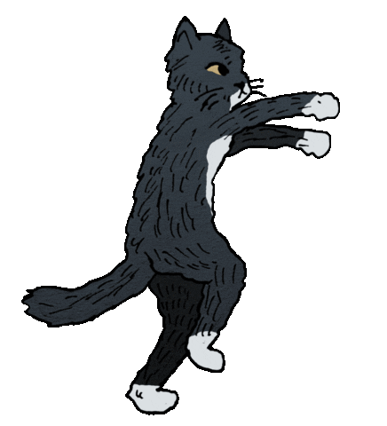
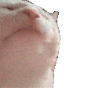

# Cat Extension

A Chrome Extension that makes two meow meow cats to vibe within your Screeennn!

## Preview

Meow Meoww

## Project Files

- `manifest.json` - Extension configuration (Manifest V3).
- `content.js` - Injects and animates the cat GIFs.
- `walking-cat.gif` - Walking animation.
- `sleeping-cat.gif` - Corner sleeping cat.
- `icon.png` - Extension icon.

## How To Load The Extension

1. Open Chrome and go to `chrome://extensions/`.
2. Turn on **Developer mode** (top-right).
3. Click **Load unpacked**.
4. Select this folder: `CatWalkingExt`.
5. Open or refresh any webpage.

Bro first clone this then follow the above steps,don't be orange cat.

## How To Use

1. After loading, browse to any website.
2. The walking cat appears near the bottom and continuously moves across the screen.
3. The sleeping cat stays in the bottom-left corner.

No extra setup is required after loading.

## Notes

- This extension runs on all URLs (`<all_urls>`).
- GIF files are exposed through `web_accessible_resources` in `manifest.json`.
